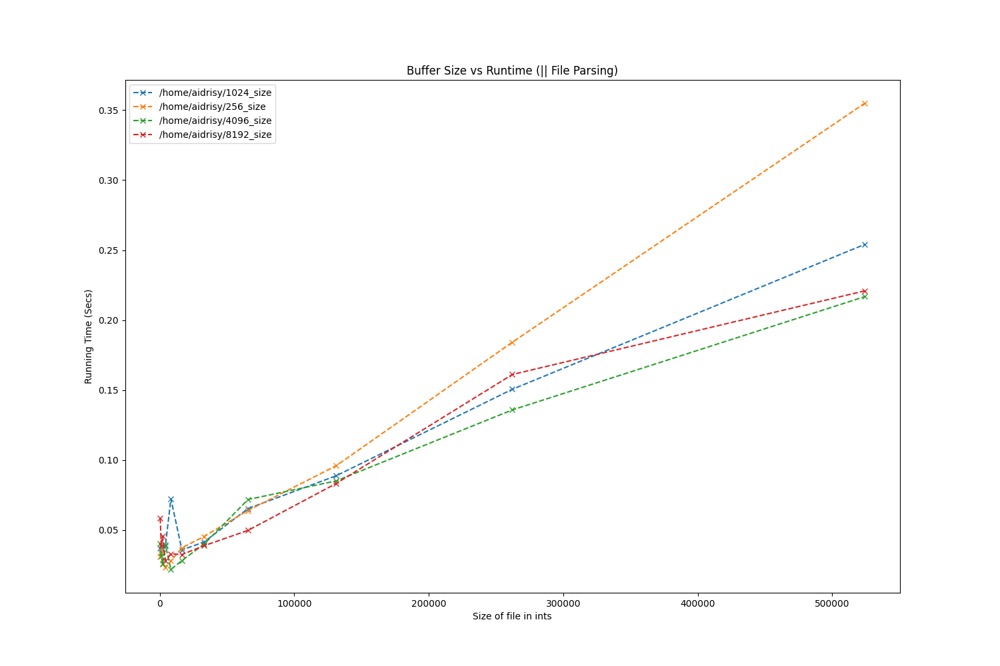
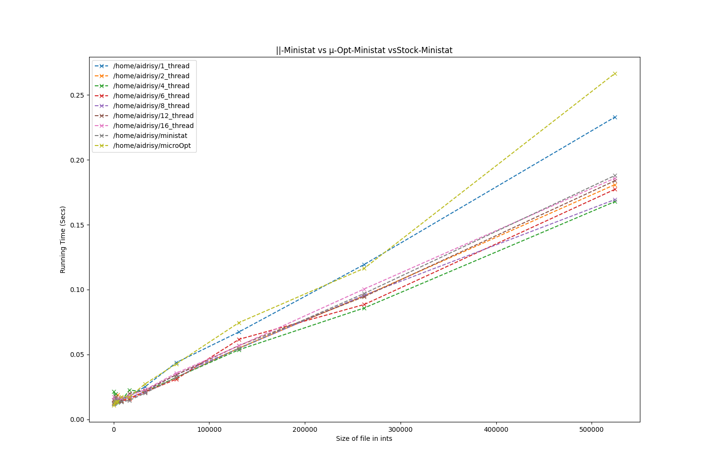
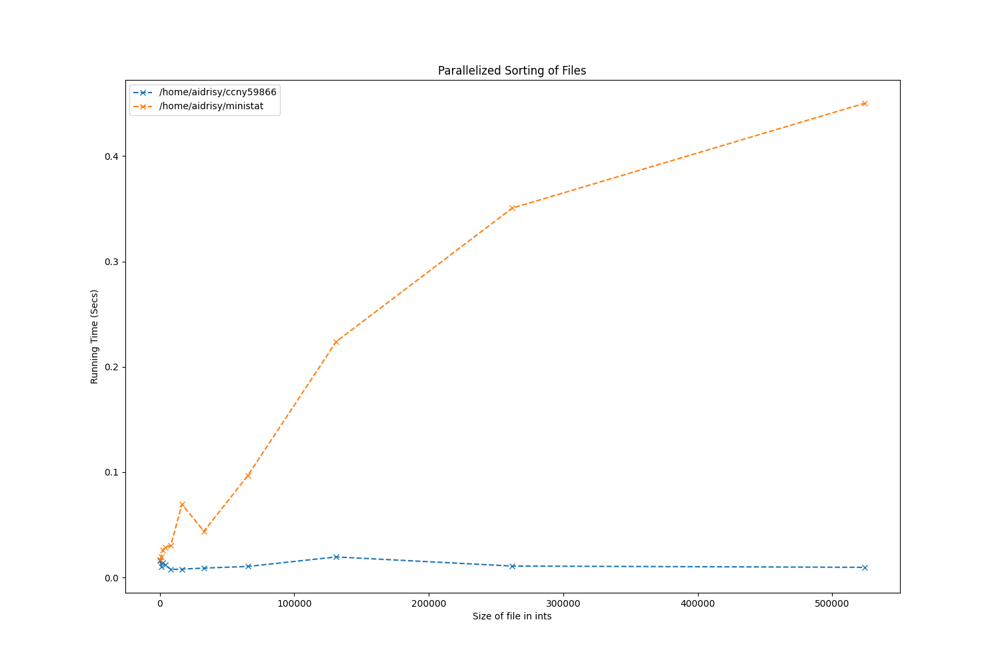
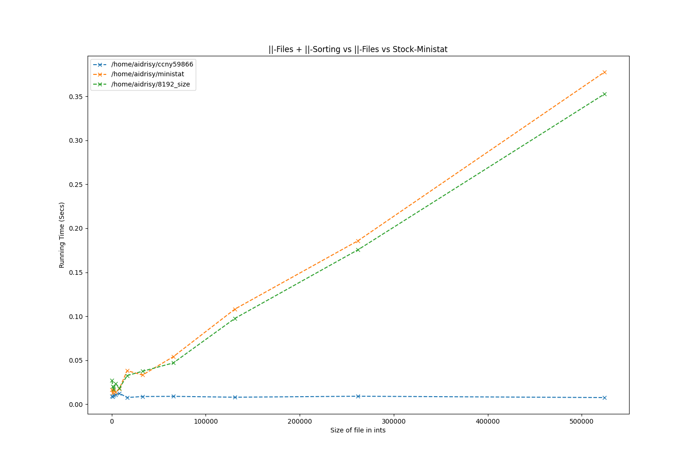

# CCNY 59866 Senior Design Project
Fall 2020 Semester

## Members: 
- Arikuzzaman Idrisy
- Ersi Nurcellari
- Fathima Reeza
- Haibin Mai
## Usage
	Extended: 
		-v : print verbose timing stastics
## Goal: 
Increase the performance of pre-existing ministat program. The objective was two fold, one, execute micro-optimizations uncovered through framegraph analysis, two, introduce mutli-threading for parallel execution.

## Investigation
Do get a profile of where program spends time `perf` was used in conjunction with a flamegraph generator for visualization. 


About 50% of the samples taken by perf are  in the sorting functions. The rest are spent in ReadSet which deals with file I/O, string tokenezation, string to double conversion, and building the dataset structures.


## Proposed Micro-Optimizations
### Reading the file contents.
- ObjectiveUse read / write / open systems calls directly to read larger blocks of data at a time. 
- Hurdles:
	- Seems the gain is very minimal and not less than CPU Noise. It also gets worse as the size of the file gets bigger.
	- The core algorithim I implemented may be incorrect leading to excesive computation.
	- Using indexes has too much overhead. Solved by swapping to ptr arithmetic where possible.
- Solution: Dont use it?


#### Ideal Buffer Size Discovery
- Objective: Find the most optimial size for raw I/O. By default this is BUFFSIZ, defiend as 8192 on my machine. This is a machine dependant directive.

Keeping the parallel file parsing thread count fixed at four, the ideal buffer size is 4096 bytes.

### String tokenization
- Objective: strtok is not is fast nor thread safe. Swap it out and use strsep instead or use memchr.
### String to double conversion.
- Objective: Replace the standard C library strtod function with an open-source alternative.
### Faster Sorting
- Objective: Replace the standard C library qsort with a faster inline sorting algorthim. https://github.com/appnexus/acf/blob/master/common/an_qsort.inc

## Multi Threading Schema
### Parallel File Parsing
- Objective: For a single file passed to ministat have multiple threads simultaneously read from the file
- Requires reworking the raw I/O micro-optimization to use pread for thread safety
	- Solved by manually keeping track of the cursor point
- Partitoning scheme was a bit counterintuive. Instead of each partion being equal number of bytes, they are set to hold whole integers. This requries looking ahead to find a \n character and adjusting the end and start points of the partitions accodingly
- Hurdle: Using one `struct dataset` per file is two slow. Using a mutex to protect writing to the dataset marginilzes any gains obtained from parallelizations.
	- Solution: Have each thread work on their own local `struct dataset`. Create the thread local datasets in the `ReadSet` function and pass it in `partition` to the `ReadPartition` function. When joining the threads call `MergeDataset` which will merge the thread local datasets to the dataset for the file. 
	- __This shows performance gains.__
```C
struct partition
{
	int fd;
	size_t start;
	size_t end;
	const char *delim;
	int col;
	struct dataset * dataSet;
	int thread;
	double timeTok;
	double timeTod;
};

```
The partition used to pass information from from `ReadSet()` into `ReadPartition()`. Stores the values needed for tokenzation as well as the start and end points in the file specified by `fd`. Is also used to hold timing statistics.

```C
//Create Partitions
for (size_t i = 0; i < THREAD_COUNT; i++)
{	
	size_t partitionEnd = partitionStart + targetSize -1;

	pread(fileDescriptor,lookAhead,1, partitionEnd);
	while(lookAhead[0] != '\n')
	{
		//printf(":InLoop:Look ahead char = [%s]  \n",lookAhead);
		partitionEnd++;
		pread(fileDescriptor,lookAhead,1,partitionEnd);
	}
	
	struct dataset * localSet = NewSet();
	allLocalSets[i] = localSet;
	struct partition * currentPartition =  
		NewPartition(partitionStart, partitionEnd,fileDescriptor,delim,allLocalSets[i],column,i);

	allPartitions[i] = currentPartition;
	partitionStart = partitionEnd + 1;
}	

```
Partition creation algorhtim in `ReadSet()`

This graph shows interesting behavior, 6 threads is higher than the baseline `ministat` edition. Two and four threads almost equaly performant as the baseline. Eight threads shows a clear performance gain on large file sizes.


Here the micro optimimzed ministat is thrown into the mix. It behaves as expected with previous analysis, it gets worse than a serialized `ministat` as the file size gets bigger.

### Parallel Sorting
- Objective: Have each file be processedi n parallel. This will parallelize the serial overhead seen if Parallel File Parsing was done alone.
- Requires: A struct to pass parameters. Other than that its minimal changes due to each file having its own dataset.


As seen the parallelized version (blue) works leagues beetter than the original serialized ministat(orange). Also the parallelized version has an almost constant execution time regardless of file size. 



The green line is a version of ministat that __only__ has parallel file parsing, and no parallel sorting. As seen the gains are massive. 

```C
pthread_t *threads = malloc(sizeof(pthread_t)*(nds));
for (i = 0; i < nds; i++){
	struct args *arguments = (struct args *)malloc(sizeof(struct args));
	arguments->fd = argv[i];
	arguments->column = column;
	arguments->i = i;
	arguments->flag_t = flag_t;
	arguments->delim = delim;
	pthread_create(&threads[i],NULL,readset_t,(void*)arguments);
}
for (i = 0; i < nds; i++){
	pthread_join(threads[i],NULL);
}
```
Code snippit showing thread creation and joing for prallel calls of ReadSet.

```C
void *readset_t(void *var) 
{
	struct args *arg = (struct args *)malloc(sizeof(struct args));
	arg = (struct args*) var;
	datas[arg->i] = ReadSet(arg->fd,arg->column,arg->delim,arg->flag_t);
    return NULL; 
}
```
The new `void * readset_t` unpacks the args for the `ReadSet` function.


---

# Pre-Existing README

## Original Repo: https://github.com/thorduri/ministat

## ministat
A small tool to do the statistics legwork on benchmarks etc.

Written by Poul-Henning Kamp, lured into a dark Linux alley and clubbed over the head and hauled away to Github by yours truly.

## Build & Install

There should be no dependencies besides the standard libraries and a functional tool-chain.

	$ cd ministat/
	$ make
	$ make PREFIX=/usr install
	install -m 0755 ministat  /usr/bin/ministat

## Usage
The FreeBSD man page is very relevant, pursue it [here](http://www.freebsd.org/cgi/man.cgi?ministat).

	Usage: ministat [-C column] [-c confidence] [-d delimiter(s)] [-ns] [-w width] [file [file ...]]
		confidence = {80%, 90%, 95%, 98%, 99%, 99.5%}
		-C : column number to extract (starts and defaults to 1)
		-d : delimiter(s) string, default to " \t"
		-n : print summary statistics only, no graph/test
		-q : print summary statistics and test only, no graph
		-s : print avg/median/stddev bars on separate lines
		-w : width of graph/test output (default 74 or terminal width)

## Example
From the FreeBSD [man page](http://www.freebsd.org/cgi/man.cgi?ministat)

	$ cat << EOF > iguana
	50
	200
	150
	400
	750
	400
	150
	EOF

	$ cat << EOF > chameleon
	150
	400
	720	
	500
	930
	EOF

	$ ministat -s -w 60 iguana chameleon
	x iguana
	+ chameleon
	+------------------------------------------------------------+
	|x      *  x	     *	       +	   + x	            +|
	| |________M______A_______________|			     |
	| 	      |________________M__A___________________|      |
	+------------------------------------------------------------+
	    N	  Min	     Max     Median	   Avg	     Stddev
	x   7	   50	     750	200	   300	  238.04761
	+   5	  150	     930	500	   540	  299.08193
	No difference proven at 95.0% confidence
